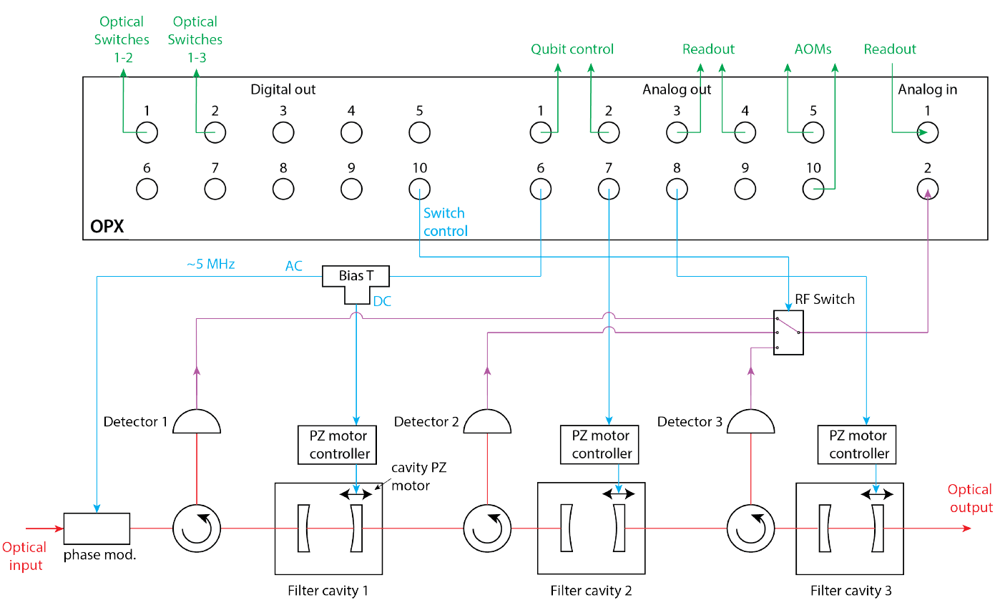

# Pound-Drever-Hall locking of optical cavities with the OPX
*Author: Theo Laudat*

*Demonstrated on the experiment of Sam Pautrel in the Lab of Prof. Yiwen Chu in ETH Zurich.*

*Important note: The code in this folder is tailored for a very specific setup and software environment. Thus, the code is only for inspiration.*

The goal of this use-case is to show how to implement a PID lock for stabilizing optical cavities with the OPX.
We will show the different building blocks used to lock one cavity and how to concatenate them in order to lock multiple cavities in cascade.

## 1. Context and experimental set-up

Optomechanical experiments are influenced by classical excess laser phase noise that require the need of optical filter cavities [1,2]. On one side, to laser cool a resolved mechanical resonator to a phonon occupancy <1, the frequency laser frequncy noise $\bar{S}_{\omega \omega}$ at the mechanical frequency $\Omega_{m}$ needs to be kept below

**Intro about mw to optical photon transduction**

**Intro to PDH locking** [1]

The corresponding experimental set-up is as follows (cf. figure below):
* Each cavity necessitates one analog output to drive their respective piezo-electric motor controller (AO 6, 7 & 10).
* Another analog output is used to provide the Pound-Drever-Hall modulation signal to the phase modulator (AO 8).
* One analog input is connected to an RF switch which allows to probe the optical signal acquired by a photo-diode placed after each cavity (AI 1). 
* The state of the RF switch (3 pins) is controlled by three digital markers provided by three OPX digital outputs (DO 7-9).
* Four additional digital markers are used to control the optical switches rerouting the light in different sections of the full set-up (DO 1-4).
* Other channels are used for qubit control and readout, AOM drive and optical switches

**UPDATE THE FIGURE:**

## 

## References

<a id="1">[1]</a> Markus Aspelmeyer, Tobias J. Kippenberg, and Florian Marquardt, 'Cavity optomechanics', *Rev. Mod. Phys.* **86**, 1391 (2014)

<a id="2">[2]</a> Ivan Galinskiy et al., 'Phonon counting thermometry of an ultracoherent membrane resonator near its motional ground state', *Optica* **7**, 6 (2020)

<a id="3">[3]</a> Eric. D. Black, 'An introduction to Pound–Drever–Hall laser frequency stabilization', *American Journal of Physics* **69**, 79 (2001)
